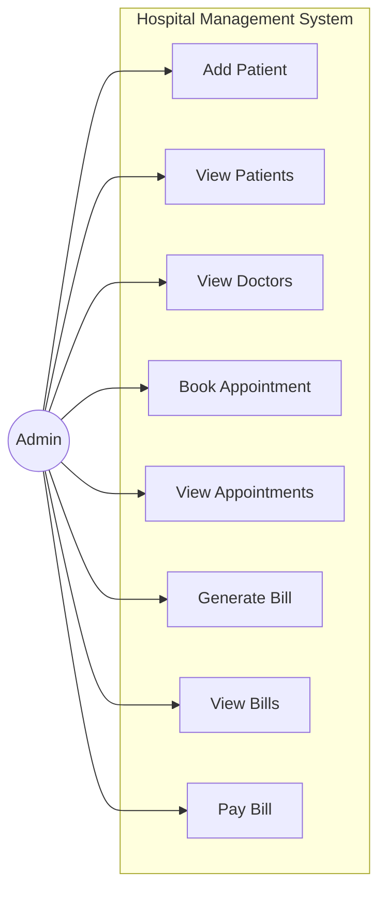
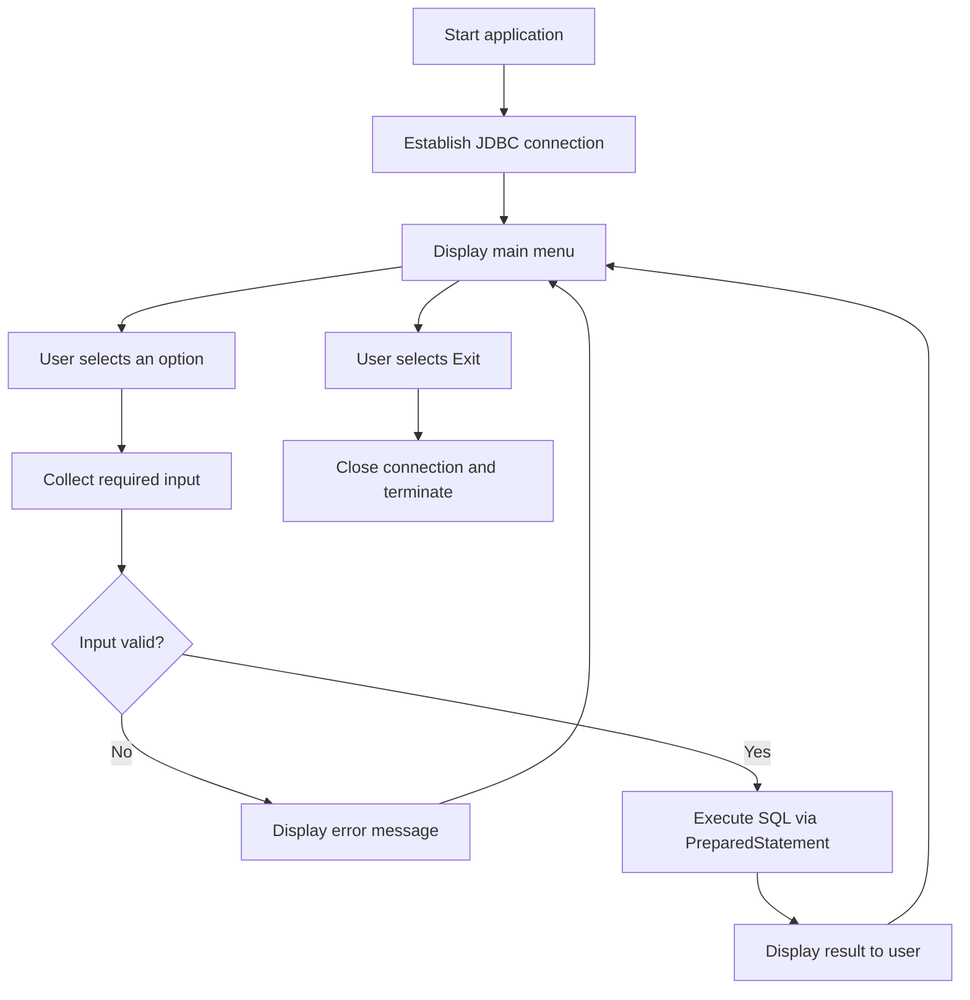
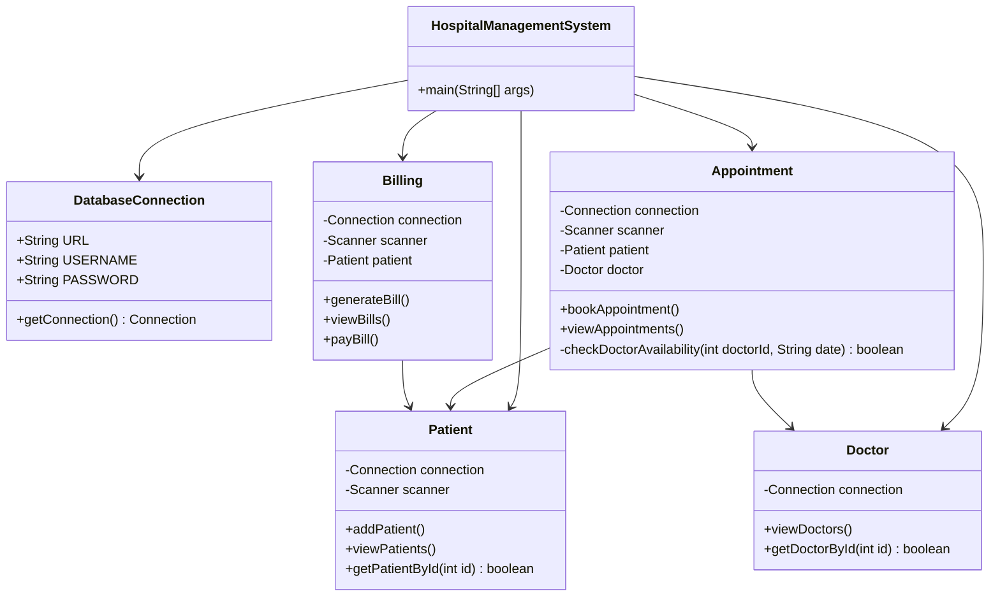
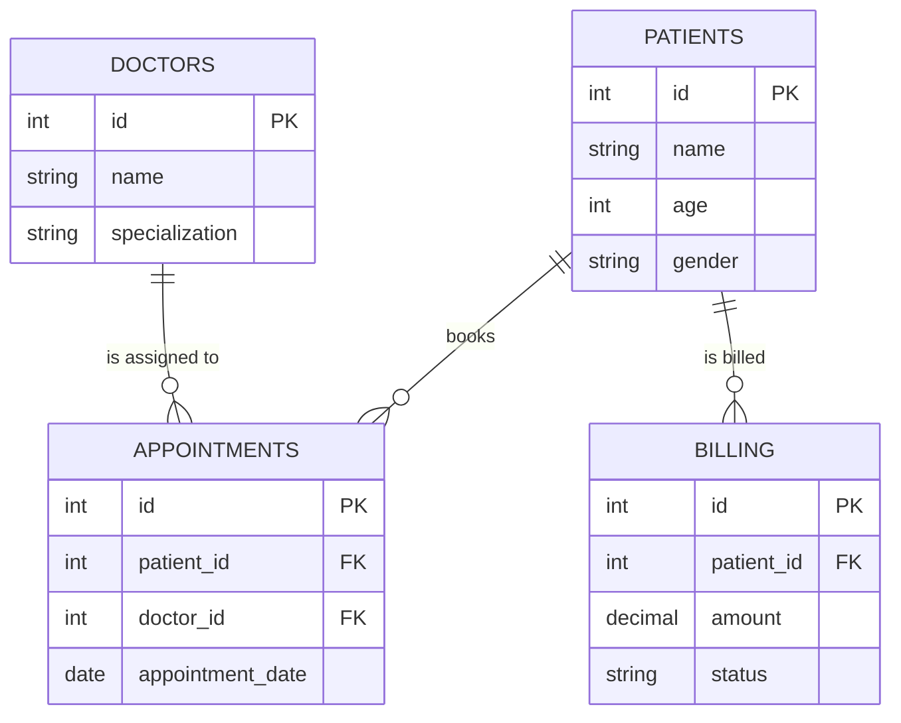

# Project Report: Hospital Management System

## 1. Cover Page

**Project Title**: Hospital Management System  
**Course Name**: Programming in Java  
**Student Name**: Rudra Rai  
**Registration Number**: 25BAI11631  
**Date of Submission**: 18/09/2026  

---

## 2. Introduction

This project is a Hospital Management System built using Java and MySQL. Its purpose is to replace paper-based record keeping with a centralised database that tracks patients, doctors, appointments, and bills. The application is console-based and uses Object-Oriented Programming principles together with JDBC to communicate with the database.

---

## 3. Problem Statement

Many small clinics and hospitals still manage patient details and appointments in manual registers. This leads to lost records, duplicated entries, and scheduling conflicts such as two patients being booked with the same doctor on the same day. This project addresses those issues by storing all records centrally in a MySQL database and enforcing validity through database constraints and application-level checks.

---

## 4. Functional Requirements

The system is organised into three main modules:

1. **Patient Module**: Add new patients to the database and view the list of registered patients.
2. **Appointment Module**: Book appointments for patients, verify that both the patient and doctor exist, and confirm that the doctor is free on the requested date.
3. **Billing Module**: Generate a bill for a patient, view existing bills, and update a bill's status once payment is made.

---

## 5. Non-functional Requirements

1. **Reliability**: Primary and foreign key constraints prevent orphaned records, such as an appointment referencing a patient who does not exist.
2. **Usability**: A numbered console menu allows the user to select an operation by entering a single digit.
3. **Maintainability**: Responsibilities are separated into distinct classes (`Patient`, `Doctor`, `Appointment`, `Billing`) rather than being combined in a single main file.
4. **Performance**: The system uses indexed primary key lookups, so record retrieval remains responsive at the data volumes expected in a small to medium clinic.

---

## 6. System Architecture

The project follows a Two-Tier Architecture:

- **Client Tier**: The Java console application, which presents the menu and handles user input.
- **Database Tier**: The MySQL server, which stores all application tables.
- **Connection Layer**: JDBC (Java Database Connectivity) transmits SQL statements from the Java application to MySQL and returns result sets.

---

## 7. Design Diagrams

### Use Case Diagram



### Workflow Diagram



### Class Diagram



### ER Diagram (Schema Design)



---

## 8. Database Schema

```sql
CREATE DATABASE hospital;
USE hospital;

CREATE TABLE patients (
    id     INT AUTO_INCREMENT PRIMARY KEY,
    name   VARCHAR(100) NOT NULL,
    age    INT NOT NULL,
    gender VARCHAR(10)  NOT NULL
);

CREATE TABLE doctors (
    id             INT AUTO_INCREMENT PRIMARY KEY,
    name           VARCHAR(100) NOT NULL,
    specialization VARCHAR(100) NOT NULL
);

CREATE TABLE appointments (
    id               INT AUTO_INCREMENT PRIMARY KEY,
    patient_id       INT  NOT NULL,
    doctor_id        INT  NOT NULL,
    appointment_date DATE NOT NULL,
    FOREIGN KEY (patient_id) REFERENCES patients(id),
    FOREIGN KEY (doctor_id)  REFERENCES doctors(id)
);

CREATE TABLE billing (
    id         INT AUTO_INCREMENT PRIMARY KEY,
    patient_id INT NOT NULL,
    amount     DECIMAL(10,2) NOT NULL,
    status     VARCHAR(20) NOT NULL DEFAULT 'PENDING',
    FOREIGN KEY (patient_id) REFERENCES patients(id)
);
```

---

## 9. Design Decisions & Rationale

- **Dedicated `DatabaseConnection` class.** Connection details are declared once in a single class rather than repeated in every module. This keeps credentials in one place and means a change of host, username, or password requires editing only one file.
- **`Scanner` for console input.** `Scanner` provides straightforward typed reads (`nextInt()`, `nextLine()`) and is well suited to a menu-driven console application.
- **`PreparedStatement` over `Statement`.** Pre-compiled statements with bound parameters prevent SQL injection, because user input is treated strictly as data rather than as part of the SQL command. They also avoid manual string concatenation, which is error-prone with quoting and date formats.
- **Constraints enforced in the database, not only in Java.** Foreign keys guarantee referential integrity even if a record is inserted through a route other than this application.

---

## 10. Implementation Details

The application is written in Java using the standard `java.sql` package, with the MySQL Connector/J driver supplied on the classpath.

- `HospitalManagementSystem.main()` obtains a single `Connection` from `DatabaseConnection`, constructs the module objects, and drives the menu loop.
- Every SQL operation is issued through a `PreparedStatement` with bound parameters.
- `Appointment.bookAppointment()` performs three checks before inserting: the patient ID must exist, the doctor ID must exist, and `checkDoctorAvailability()` must confirm no existing appointment for that doctor on that date.
- `Billing.payBill()` updates a bill's `status` column from `PENDING` to `PAID` rather than deleting the record, preserving the billing history.
- Foreign key constraints on `appointments` and `billing` enforce that referenced patients and doctors exist.

---

## 11. How to Run

1. Install MySQL Server and create the schema using the SQL in Section 8.
2. Download `mysql-connector-j` and add the JAR to the project's Build Path (in Eclipse: *Project → Properties → Java Build Path → Libraries → Add External JARs*).
3. Update `URL`, `USERNAME`, and `PASSWORD` in `DatabaseConnection.java` to match the local MySQL instance.
4. Insert sample doctors into the `doctors` table, since the application reads doctors rather than creating them.
5. Compile and run `HospitalManagementSystem.java`.

---

## 12. Screenshots / Results

**1. Adding a New Patient**


**2. Viewing Available Doctors**


**3. Booking an Appointment**


**4. Viewing Scheduled Appointments**


**5. Generating a Bill**


---

## 13. Testing Approach

The system was tested manually against the cases below.

| # | Test case | Input | Expected result | Actual result | Status |
|---|---|---|---|---|---|
| 1 | Valid patient registration | Name, age, gender | Record inserted, ID returned | Record inserted | Pass |
| 2 | Appointment with invalid patient ID | Non-existent patient ID | Booking rejected with an error message | Booking rejected | Pass |
| 3 | Appointment with invalid doctor ID | Non-existent doctor ID | Booking rejected with an error message | Booking rejected | Pass |
| 4 | Double booking | Same doctor, same date, twice | Second booking rejected | Second booking rejected | Pass |
| 5 | Bill generation | Valid patient ID, amount 5000 | Bill created with status `PENDING` | Bill created as `PENDING` | Pass |
| 6 | Bill payment | Valid bill ID | Status updated to `PAID` | Status updated | Pass |

---

## 14. Challenges Faced

- **Configuring the JDBC driver.** Adding `mysql-connector-java` to the project was not obvious at first and produced a `ClassNotFoundException` until the JAR was correctly added through the Eclipse Build Path settings.
- **`Scanner` input handling.** Mixing `nextInt()` and `nextLine()` caused the scanner to skip input lines, because `nextInt()` leaves the newline character in the buffer. This was resolved by consuming the leftover newline before reading string input.
- **Date handling.** Passing dates between Java and MySQL required consistent use of the `YYYY-MM-DD` format so that comparisons in the availability check behaved correctly.

---

## 15. Learnings & Key Takeaways

- How to connect a Java application to a relational database using JDBC, and how to manage the connection lifecycle.
- How to write and execute SQL operations (`INSERT`, `SELECT`, `UPDATE`) from within Java, and why `PreparedStatement` is preferred over `Statement`.
- How to decompose a program into cohesive classes with clearly separated responsibilities.
- How database constraints complement application logic in maintaining data integrity.

---

## 16. Limitations

- Database credentials are hard-coded in `DatabaseConnection.java`, which is unsuitable for production use.
- The application has no authentication, so any user with access to the console has full privileges.
- Appointments are stored by date only, with no time slot, so a doctor can take only one appointment per day.
- There is no facility to update or delete patient and doctor records once created.

---

## 17. Future Enhancements

- Replace the console interface with a graphical user interface built in Java Swing or JavaFX.
- Add a login system so that only authorised administrators can access patient data.
- Move database credentials into an external configuration or properties file.
- Extend appointments to include time slots, allowing multiple bookings per doctor per day.
- Add update and delete operations for patient and doctor records.

---

## 18. Conclusion

The Hospital Management System meets its objective of replacing manual clinic registers with a centralised, validated database. All three modules — patient management, appointment scheduling, and billing — function as intended, and testing confirmed that the system correctly rejects invalid references and prevents double booking. The project demonstrates practical application of Object-Oriented Programming, JDBC, and relational database design, and provides a foundation that could be extended with a graphical interface and access control.

---

## 19. References

1. Oracle. *JDBC Basics — The Java Tutorials.* https://docs.oracle.com/javase/tutorial/jdbc/
2. Oracle. *Java Platform SE API Specification: `java.sql` package.* https://docs.oracle.com/en/java/javase/17/docs/api/java.sql/java/sql/package-summary.html
3. Oracle. *MySQL Connector/J Developer Guide.* https://dev.mysql.com/doc/connector-j/en/
4. Oracle. *MySQL 8.0 Reference Manual.* https://dev.mysql.com/doc/refman/8.0/en/
5. W3Schools. *SQL Tutorial.* https://www.w3schools.com/sql/
6. Course lecture notes, Programming in Java.
